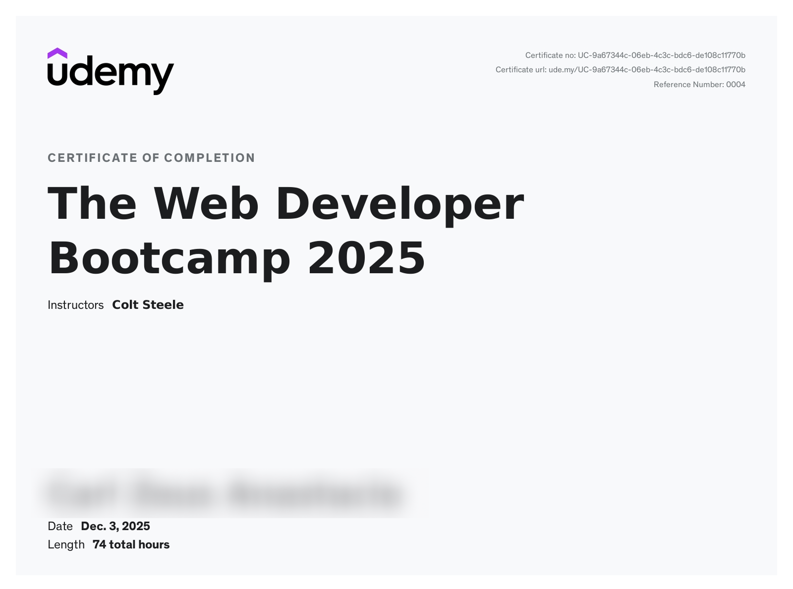

# [The Web Developer Bootcamp](https://www.udemy.com/course/the-web-developer-bootcamp/)

Note: I stopped taking this course because it felt too slow and repetitive for my skill level, so this repository only covers the parts I completed and some parts ill just watch for learning

- Frontend: HTML5, CSS3, Flexbox, Grid, Responsive Design, Bootstrap, Bulma, Semantic UI
- JavaScript: Core syntax, ES6+, DOM manipulation, AJAX, async/await, Promises
- Backend: Node.js, Express.js, REST APIs, Middleware
- Databases: MongoDB, Mongoose, schema design, database associations
- Auth & Security: Authentication from scratch, sessions & cookies, authorization, common security issues (XSS, SQL injection)
- Templating: EJS, layouts, partials
- Command Line: Unix basics
- Deployment: Cloud databases, environment variables, deploying apps
- Extras: Image upload & storage, maps & geocoding, developer best practices

*This repository serves as a record of my personal learning journey. It is not intended as a tutorial or solution set*

### Certificate
